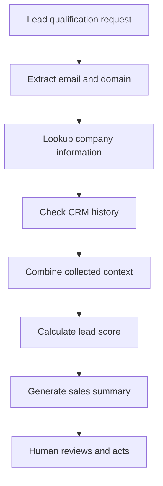

# 🧠 Chain-of-Thought(CoT) Agentic CRM Lead Qualification Agent

> An AI agent for sales representatives that researches lead context, checks CRM history, assigns a priority score, and produces a concise qualification summary.

---

## 1️⃣ Project Title & Value Proposition

**Agentic CRM Lead Qualification Agent for sales teams, turning a lead email into an actionable High, Medium, or Low priority summary.**

The agent reduces the manual work required to prepare for sales calls. Given an email address, it identifies the company domain, retrieves company attributes and CRM history, calculates a lead score, and synthesizes the findings for a busy sales representative.

---

## 2️⃣ Background & Problem Context

Sales representatives regularly receive leads with limited context and must decide which opportunities deserve immediate attention. Qualifying each lead requires searching for company information, reviewing prior interactions, applying scoring rules, and condensing the findings into a useful brief.

- Lead data is distributed across external company sources and internal CRM records.
- Sales representatives repeat the same research and scoring process for every lead.
- Manual qualification becomes slow and inconsistent as lead volume increases.
- Fixed scripts can retrieve data but do not reliably decide which tool to use next or explain the combined result.
- Missed context can cause high-value leads to receive late or inappropriate follow-up.

---

## 3️⃣ Target User & Job To Be Done (JTBD)

- **Primary user:** Sales representative or account executive preparing for lead outreach.
- **Secondary users:** Sales operations managers and revenue operations teams maintaining qualification rules.
- **JTBD:** Quickly qualify an inbound lead from an email address, understand the relevant company and CRM context, and receive a clear priority recommendation before taking action.

---

## 4️⃣ Why an Agentic Approach (Very Important)

A conventional script works well when every input, data source, and execution step is predetermined. Lead qualification requires the system to interpret a natural-language request, extract the relevant email and domain, select tools, combine heterogeneous results, and translate the evidence into an audience-appropriate summary.

The agentic loop allows the model to:

- Decide when and how to call the available tools.
- Maintain collected context across multiple tool calls.
- Adapt its final response to the available company and CRM evidence.
- Separate deterministic scoring logic from natural-language reasoning and presentation.
- Continue tool execution until it has enough information to answer the user.

The current notebook constrains the agent with a prescribed workflow, while still allowing the model to generate and sequence function calls dynamically.

---

## 5️⃣ Agent Role, Scope & Autonomy Level

### Agent responsibilities

- Parse a lead qualification request and identify the supplied email address.
- Derive the company domain from the email.
- Retrieve company information and CRM history.
- Combine the retrieved data into a consistent context object.
- Invoke deterministic lead-scoring logic.
- Produce a concise summary for the sales representative.

### Human responsibilities

- Review the result before contacting the lead or changing a CRM record.
- Maintain the company, CRM, and scoring data used by the tools.
- Resolve incomplete, conflicting, or incorrect lead information.

### Restricted actions

The prototype does **not** modify CRM records, send messages, schedule meetings, or contact leads. It only retrieves mock data, calculates a score, and presents a recommendation.

---

## 6️⃣ Agent Architecture & Components

### a) Planner / Decision Layer

`gpt-4o` receives the system instructions and user request, determines the required function calls, and decides when enough information has been collected to generate the final summary.

### b) Executors / Tools

- `lookup_domain_info(domain)` retrieves industry, company size, and revenue data.
- `check_crm_history(email)` retrieves the lead's last-contact date, status, and notes.
- `calculate_lead_score(data_summary)` applies deterministic rules and returns a High, Medium, or Low score.

The notebook uses `AVAILABLE_FUNCTIONS` to map model-requested tool names to local Python functions and JSON schemas to constrain tool arguments.

### c) Memory

- **Short-term memory:** The `messages` list retains the system prompt, user request, assistant tool calls, and tool results for the current run.
- **Working state:** The `collected_data` dictionary stores company and CRM data between tool calls.
- **Long-term memory:** Not implemented. The demo uses in-memory mock databases and does not persist results between runs.

### d) Orchestration Logic

The `run_agent()` loop sends the conversation to the model, executes requested functions, appends each result as a tool message, and repeats until the model returns a response without additional tool calls. Unknown function names are rejected and logged.



---

## 7️⃣ End-to-End Agent Workflow

1. The user submits a natural-language request containing a lead email address.
2. The model identifies the domain portion of the email.
3. The agent calls `lookup_domain_info` to retrieve company attributes.
4. The agent calls `check_crm_history` to retrieve previous sales activity.
5. The orchestration loop stores both results in `collected_data`.
6. The agent calls `calculate_lead_score` with the combined context.
7. The scoring tool applies the following demo rules:
   - Revenue beginning with `$1B+` → **High**
   - CRM status of `Active Opportunity` → **High**
   - Revenue beginning with `$50M` → **Medium**
   - Otherwise → **Low**
8. The model synthesizes the company profile, CRM history, and score into a readable sales brief.
9. The user reviews the recommendation before taking any external action.

---

## 8️⃣ Tools, Models & Stack (With Rationale)

| Component | Technology | Role and rationale |
|---|---|---|
| Language model | OpenAI `gpt-4o` | Interprets natural language, selects tools, and synthesizes structured results into a concise summary. |
| Agent interface | OpenAI Chat Completions API | Supports multi-turn messages and structured function calling. |
| Runtime | Python | Provides a simple environment for tool definitions, orchestration, and JSON processing. |
| Tool contracts | JSON schemas | Constrain function names, required fields, and argument types. |
| Configuration | `python-dotenv` and Google Colab `userdata` | Loads the OpenAI API key without hard-coding it in the notebook. |
| Demo data | In-memory Python dictionaries | Makes the prototype deterministic and easy to run without external CRM or enrichment services. |

---

## 9️⃣ Evaluation Strategy & Metrics

The notebook includes two demonstration scenarios, but it does not yet implement an automated evaluation suite. A production evaluation should track:

- **Tool-selection accuracy:** Percentage of runs that invoke every required tool with valid arguments.
- **Scoring accuracy:** Agreement between agent results and a labeled qualification dataset.
- **Task success rate:** Percentage of inputs that produce a complete company, CRM, score, and summary response.
- **Latency:** End-to-end time from request submission to final summary.
- **Cost per run:** Model-token and external-tool cost for one qualified lead.
- **Human intervention rate:** Percentage of results requiring correction or additional research.
- **False-positive rate:** Low-quality leads incorrectly classified as high priority.
- **False-negative rate:** Valuable leads incorrectly classified as low priority.

Suggested acceptance targets should be established against real CRM data before production use; no benchmark results are claimed by this prototype.

---

## 🔟 Guardrails, Trust & Safety

- The agent is read-only and cannot change CRM records or initiate customer-facing actions.
- Lead scoring is performed by visible deterministic rules rather than an unbounded model judgment.
- Function schemas restrict the arguments exposed to the model.
- Unknown tool requests are rejected by the function-mapping layer.
- Tool calls and intermediate execution steps are printed for observability.
- Missing company or CRM data falls back to explicit `Unknown`, `N/A`, or `No Record` values.
- A human remains responsible for validating the result and deciding the next sales action.
- Production use should add authentication, authorization, audit logs, sensitive-data controls, and prompt-injection defenses.

---

## 1️⃣1️⃣ Failure Modes & Tradeoffs

- The mock databases recognize only a small set of domains and email addresses.
- Scoring rules are intentionally simple and may not represent real sales priorities.
- Incorrectly formatted emails can lead to invalid domain lookups.
- The orchestration loop has no maximum-iteration limit, retry policy, timeout, or structured recovery path.
- Tool results are trusted without schema validation after execution.
- Model-selected tool order may vary even though the prompt requests sequential execution.
- The implementation uses the legacy-style Chat Completions tool loop rather than a durable production agent runtime.
- Better reasoning and summaries can increase model latency and cost; stricter deterministic control can reduce flexibility.

---

## 1️⃣2️⃣ Results, Learnings & Insights

- Structured tool calling cleanly separates language-model decisions from executable business logic.
- Persisting tool results in `collected_data` gives the scoring function access to evidence gathered earlier in the run.
- Deterministic scoring makes the final recommendation easier to inspect and explain.
- Mock tools are useful for validating orchestration before integrating external systems.
- The prototype exposes an important production requirement: tool-call traces and final outputs need automated validation, not only manual notebook inspection.
- The demo scenario comments do not always match the implemented scoring rules, reinforcing the need for test assertions instead of descriptive labels alone.

---

## 1️⃣3️⃣ Future Improvements & Iteration Plan

- Replace mock dictionaries with authenticated CRM and company-enrichment APIs.
- Validate email addresses and normalize domains before tool execution.
- Add Pydantic models or equivalent schema validation for every tool result.
- Introduce iteration limits, retries, timeouts, and explicit fallback behavior.
- Build a labeled evaluation dataset with automated regression tests.
- Return a structured result containing evidence, score, rationale, and confidence.
- Add configurable scoring policies for different products, regions, and sales segments.
- Persist approved results and feedback to improve future qualification rules.
- Add human approval before any CRM update or customer-facing action.
- Migrate to a production-ready agent interface with stronger tracing and observability.

---

## 1️⃣4️⃣ Demo & Artifacts

The repository's Jupyter notebook contains the complete prototype and two sample executions:

- `jane@acmecorp.com` demonstrates a known company with cold-lead CRM history.
- `bob@widgetco.net` demonstrates a known company with an active opportunity.

### Run locally

```bash
pip install openai python-dotenv jupyter
```

Create a `.env` file or configure Google Colab secrets with an OpenAI API key:

```env
OPENAI_APIKEY=your_api_key_here
```

Open the notebook, run the cells in order, and replace the sample lead email with the lead you want to qualify. The current client initialization reads the key from Google Colab's `userdata`; for local Jupyter use, update it to read `os.getenv("OPENAI_APIKEY")`.

> ⚠️ Never commit API keys or `.env` files to the repository.

---

## 1️⃣5️⃣ Role-Based Signal (Mandatory)

- **For Product Managers:** Demonstrates operational problem framing, user-centered workflow design, measurable success criteria, trust boundaries, and explicit product tradeoffs.
- **For Engineering Managers:** Demonstrates agent orchestration, tool contracts, state management, modular architecture, failure analysis, and a path from prototype to scalable service.
- **For Software Engineers:** Demonstrates Python function calling, JSON-based interfaces, deterministic business rules, tool dispatch, conversational state, and testable component boundaries.

---
